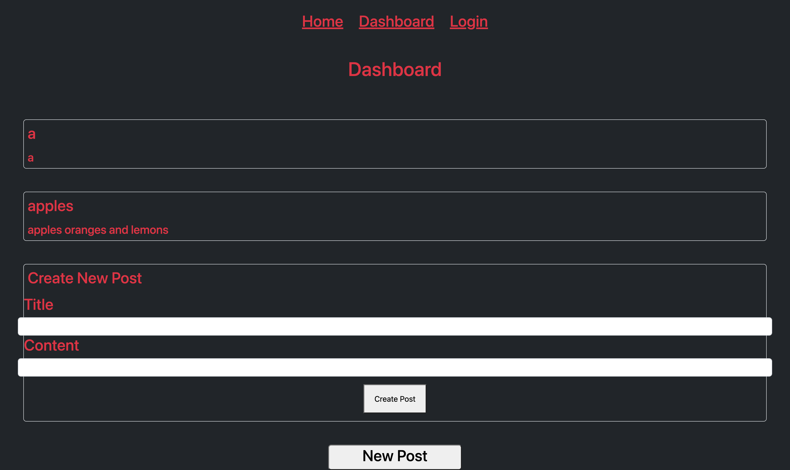

# MVC-tech-blog

[github-repo](https://github.com/Will-Dean5/MVC-tech-blog)
[heroku](https://radiant-sea-13109.herokuapp.com/)

## Description

This is a application that is supposed to be a blog for model view controllers, This blog has a log in page that you will log in to before you can post on the blog. If you do not have an account yet for the blog there will be a area below the login that you can sign up for an account for the blog. Once you sign up or sign in you will be presented with the home page. The home page consists of an area where you can make a post. The post box includes a title and body for your post, once you enter what you want to post you will click the create post button and the post will appear on the homepage and above the post box. Above the post box is a navbar that consists of Home, Dashboard, and Login, if you click these they will take you to the corresponding page.


## Instructions

If you are running this on your computer you will have to do a ```npm i``` and you will have to run ```npm run db:sync``` ```npm run seed``` and finally ```nodemon``` or ```npm start```
## Visuals


